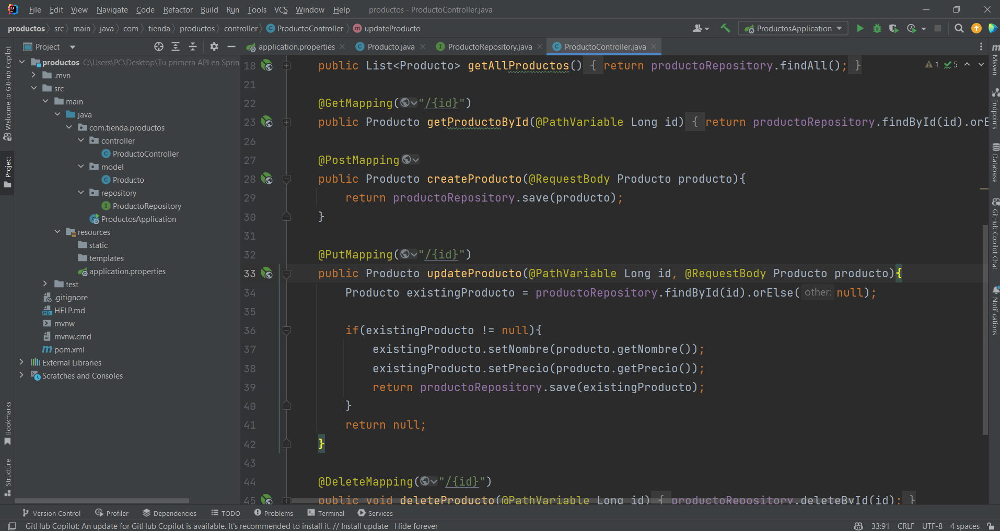
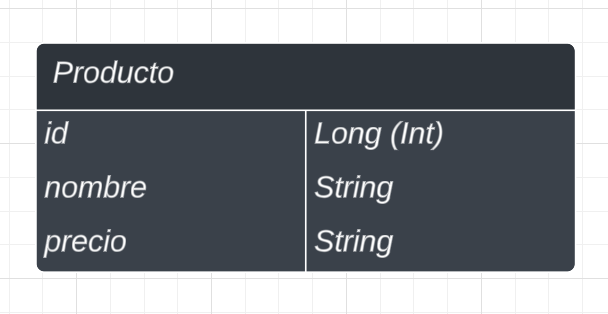
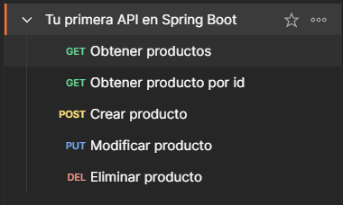

# Documentación de Tu Primera API explicado desde cero (CRUD de Productos)



## Descripción del proyecto

Este pequeño proyecto radica en la creación de una API sencilla para explicar como funcionan de manera general las APIs, en este caso el código esta creado en Java (Spring Boot) pero los conocimientos pueden transferirse a cualquier otro lenguaje de programación. Por lo cual, en esta API haremos el manejo CRUD de Productos.



## Recursos
El proyecto esta creado con las siguientes tecnologías.

| Plugin                | URL                      |
|-----------------------|--------------------------|
| Spring Web            | https://start.spring.io/ |
| Spring Data JPA       | https://start.spring.io/ |
| Lombok                | https://start.spring.io/ |
| H2 Database           | https://start.spring.io/ |

## Accesos

Acceso a la base de datos H2 mediante URL:

```sh
url: http://localhost:8080/h2-console/
user: sa
password: pass
```

## Uso en Postman



### GET (Obtener productos)
```sh
http://localhost:8080/api/productos
```

### GET (Obtener producto por ID)
```sh
http://localhost:8080/api/productos/1
```

### POST (crear Producto)
```sh
http://localhost:8080/api/productos
```
Hay que insertar un JSON para esta petición.

``` json
{
    "nombre": "Tablet",
    "precio": 1000.50
}
```

### PUT (editar Producto)
```sh
http://localhost:8080/api/productos/1
```

Hay que insertar un JSON para esta petición.

``` json
{
    "id": 1,
    "nombre": "Celular",
    "precio": 499.50
}
```

### DELETE (eliminar producto)
```sh
http://localhost:8080/api/productos/5
```
